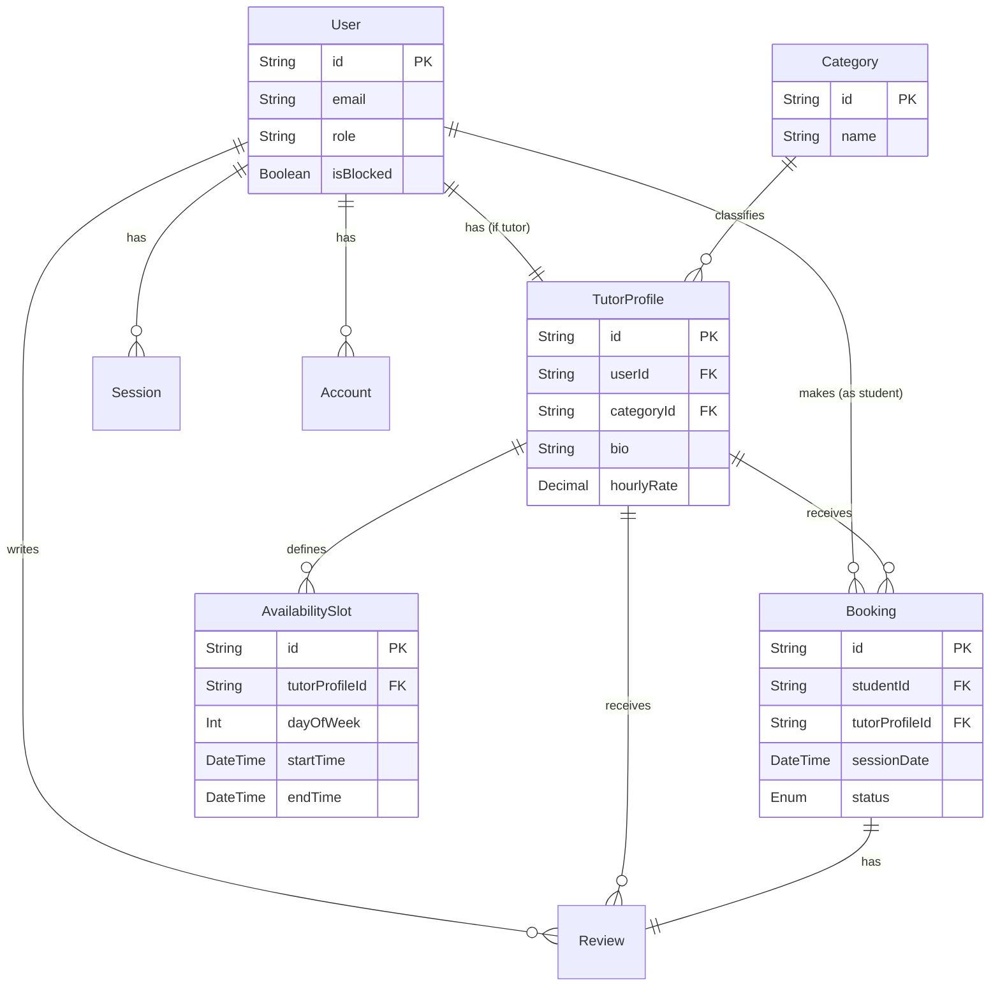
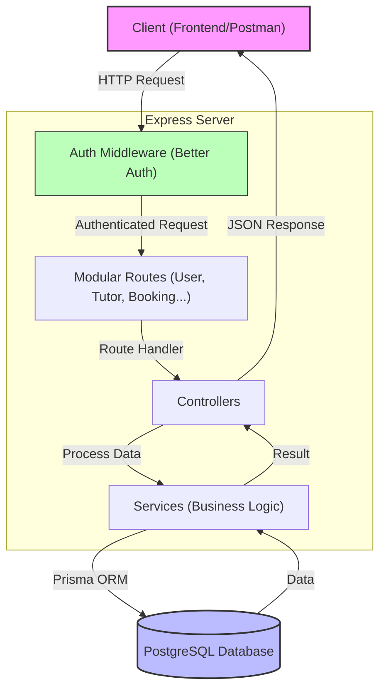

<div align="center">
  <br />
    <a href="https://github.com/Start-Impact/skill-bridge-backend" target="_blank">
      
    </a>
  <br />

  <div>
    
    
    
    
    
    
    

  </div>

  <h3 align="center">Skill Bridge Backend</h3>

   <div align="center">
    Connect with Expert Tutors, Learn Anything.
    </div>
</div>

## 📋 <a name="table">Table of Contents</a>

1. [Overview](#overview)
2. [Key Features](#features)
3. [Tech Stack](#tech-stack)
4. [Database Architecture](#database-architecture)
5. [Project Structure](#project-structure)
6. [API Documentation](#api-documentation)
7. [Quick Start](#quick-start)

## <a name="overview">Overview</a>

**Skill Bridge** is a comprehensive backend API designed to power a robust mentorship platform. It facilitates connections between students and tutors, handling everything from user authentication and profile management to session scheduling and reviews. Built with performance and scalability in mind, it leverages a modern stack to ensure a seamless experience for all users.

## <a name="features">Key Features</a>

- **🔐 Secure Authentication**: Robust user authentication and management using **Better Auth**, supporting multiple roles (Student, Tutor, Admin).
- **📅 Dynamic Scheduling**: Real-time booking system allowing students to schedule sessions based on tutor availability.
- **👨‍🏫 Tutor Management**: Detailed tutor profiles with expertise info, hourly rates, and availability slots.
- **🕵️ Advanced Search**: Category-based filtering to help students find the perfect mentor.
- **⭐ Review System**: Transparent feedback loop with ratings and reviews for completed sessions.
- **📧 Email Notifications**: Integrated email service (Nodemailer) for booking confirmations and updates.
- **☁️ Cloud Storage**: Media management using Cloudinary for profile pictures and assets.

## <a name="tech-stack">The Tech Stack</a>

| Component     | Technology                                                                                                                                                                                   | Description                                                 |
| :------------ | :------------------------------------------------------------------------------------------------------------------------------------------------------------------------------------------- | :---------------------------------------------------------- |
| **Runtime**   |                                                                                      | JavaScript runtime built on Chrome's V8 engine.             |
| **Framework** |                                                                                        | Fast, unopinionated, minimalist web framework for Node.js.  |
| **Language**  |                                                                               | Typed superset of JavaScript for better tooling and safety. |
| **Database**  |                                                                               | Powerful, open source object-relational database system.    |
| **ORM**       |                                                                                           | Next-generation ORM for Node.js and TypeScript.             |
| **Auth**      | <div style="display: flex; align-items: center; gap: 8px;"> <strong>Better Auth</strong></div> | Comprehensive authentication solution.                      |
| **Storage**   |                                                                               | Cloud-based image and video management.                     |

## <a name="database-architecture">Database Architecture</a>

The database is normalized and designed to support complex relationships between users, bookings, and content.



## <a name="project-structure">Project Structure</a>

The project follows a modular and scalable structure.

```bash
skill-bridge-backend/
├── prisma/                 # Database schema and migrations
│   ├── schema/             # Split schema files
│   └── migrations/         # History of database changes
├── src/
│   ├── api/                # API routes and controllers
│   ├── lib/                # Shared libraries and utilities
│   ├── modules/            # Feature-based modules (Users, Bookings, etc.)
│   ├── scripts/            # Admin seeding and maintenance scripts
│   ├── static/             # Static assets
│   └── server.ts           # Application entry point
├── .env.example            # Example environment variables
├── package.json            # Project dependencies and scripts
└── tsconfig.json           # TypeScript configuration
```

## <a name="api-documentation">API Documentation</a>

Detailed documentation for all API endpoints is available separately.

👉 **[Explore API Documentation](docs/API.md)**

## <a name="backend-architecture">Backend Architecture</a>

The following diagram illustrates the request flow through the system:



## <a name="quick-start">Quick Start</a>

Follow these steps to set up the project locally.

### Prerequisites

- **Node.js** (v18+)
- **pnpm** (preferred package manager)
- **PostgreSQL** (Local or Cloud instance)

### Installation

1. **Clone the repository**

   ```bash
   git clone https://github.com/your-username/skill-bridge-backend.git
   cd skill-bridge-backend
   ```

2. **Install dependencies**

   ```bash
   pnpm install
   ```

3. **Set up Environment Variables**

   ```bash
   cp .env.example .env
   # Open .env and configure your database URL, cloud keys, and auth secrets
   ```

4. **Database Setup**

   ```bash
   # Generate Prisma Client
   npx prisma generate

   # Push schema to database
   npx prisma migrate dev --name init
   ```

5. **Seed the Database**

   ```bash
   pnpm seed:admin
   ```

6. **Run the Server**

   ```bash
   pnpm dev
   ```

   The server will start at `http://localhost:5000` (or your configured port).

---

<div align="center">
  <br />
  <strong>Made with ❤️ by Sajid Khan</strong>
</div>
